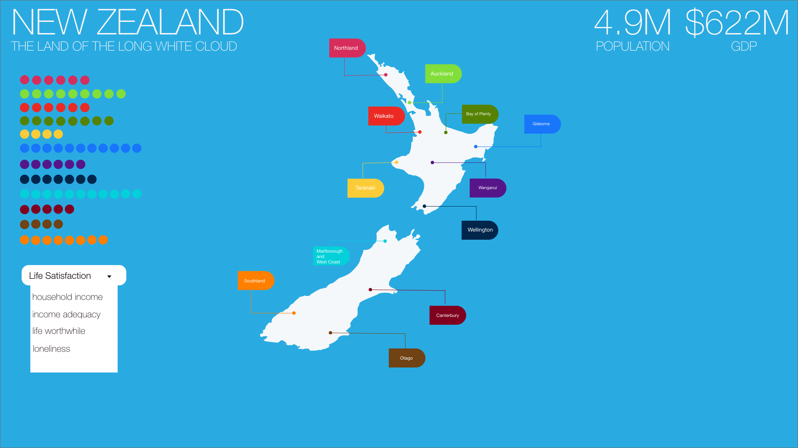

### Analysing NZ Stats Open Data.

This project goes through the open data available for use from the [stats nz](https://www.stats.govt.nz/large-datasets/csv-files-for-download/) website.

My aim is to apply appropriate visualisation methods to understand the data. 

### Overseas Import and Exports
The `initial_analysis` notebook starts with the `Overseas trade index: March 2019 quarter (provisional) – CSV` I didn't include the files in this repo due to size.

### Initial Design of Site using Adobe XD:
